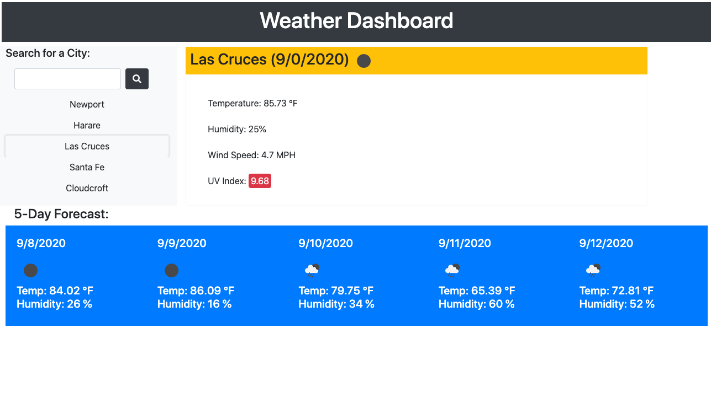

# weather-dashboard

## Weather Dashboard - Features
* When a user loads the page the user is presented with a search box
* When the user types in a city name and presses the search button, their cities current information is displayed on the screen.
* The user can see the current date, an icon displaying the current weather condition as well as a UV index.
* The UV index is color coded - green for good, turqoise for okay, yellow for warning and red for high. 
* A five day forecast is also presented to the user letting the user see the temperature, humidity and a weather icon for each date. 
* The city the user searched for is displayed in a list under the search box. 
* When the user clicks on a city name in the list, the current weather is displayed as is the five day forecast. 
* The cities the user searched for, persist on the page in the list. 

## Screenshot
